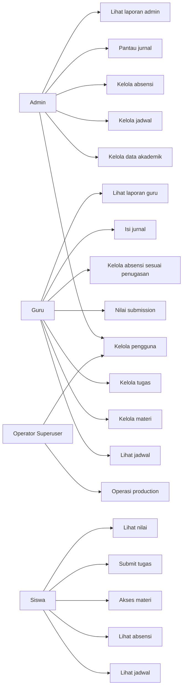
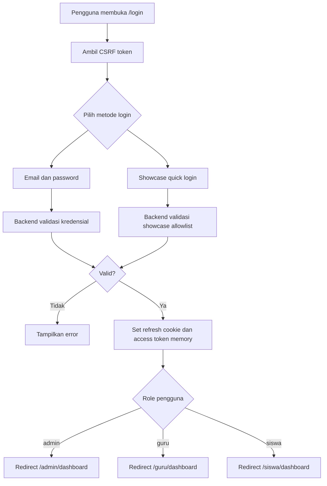
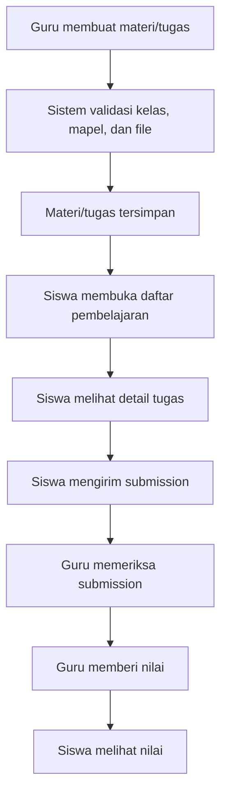
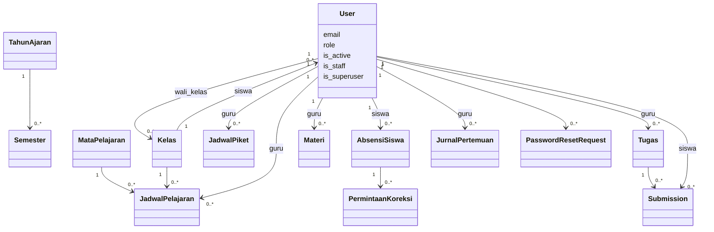
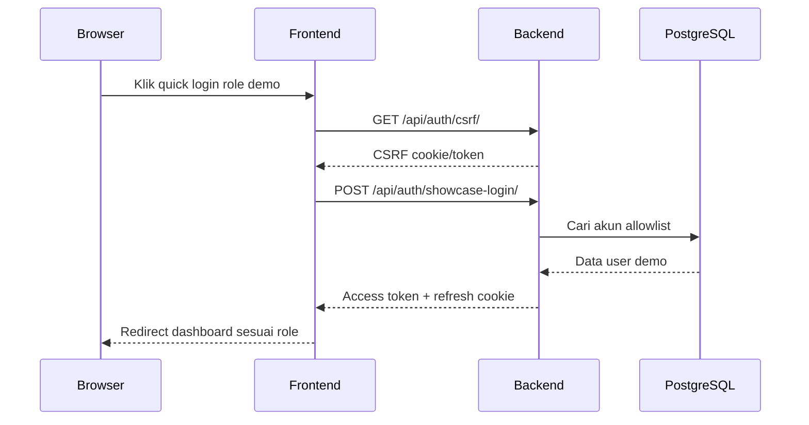
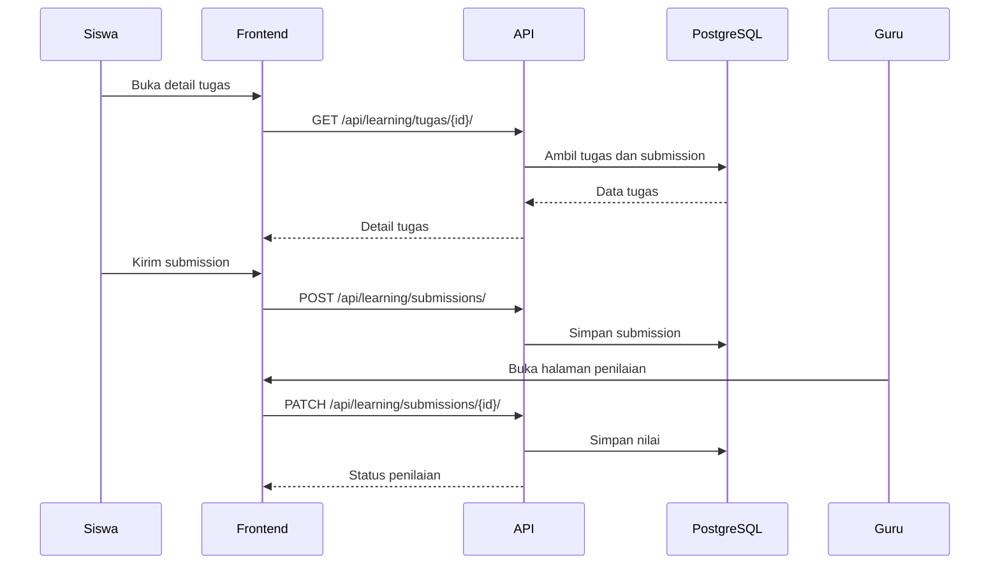

# Software Requirements Specification (SRS) CORELASI

## Metadata Dokumen

| Atribut | Keterangan |
| --- | --- |
| Nama Produk | CORELASI |
| Nama Lengkap | Sistem Administrasi Akademik SMAT Baiturrahman |
| Versi Dokumen | 1.1 |
| Status | Diselaraskan dengan kondisi implementasi dan production demo |
| Tanggal Baseline | 14 Juni 2026 |
| Target Pengguna | Admin, Guru, Siswa, dan Operator Superuser |
| URL Production Demo | `https://app.corelasi.my.id` |
| URL Fallback Privat | `https://desktop-0e2e0e5-1.tail320122.ts.net` |
| Sumber Penyelarasan | Codebase CORELASI-1, production runbook, handoff Codex, dan laporan pengujian |

## Riwayat Revisi

| Versi | Tanggal | Perubahan |
| --- | --- | --- |
| 1.0 | 2026-06-03 | SRS awal berdasarkan rancangan aplikasi CORELASI. |
| 1.1 | 2026-06-14 | Diselaraskan dengan implementasi aktual: Django/DRF, React/Vite, PostgreSQL, deployment Cloudflare Tunnel, autentikasi secure cookie, RBAC native, showcase login, laporan testing, dan hardening production. |

# 1. Pendahuluan

## 1.1 Tujuan Penulisan Dokumen

Dokumen ini mendefinisikan kebutuhan perangkat lunak CORELASI sebagai sistem administrasi akademik berbasis web untuk SMAT Baiturrahman. Dokumen ini menjadi acuan bersama untuk:

1. Menjelaskan lingkup fitur yang sudah menjadi baseline implementasi.
2. Menyamakan pemahaman antara tim pengembang, QA, UI/UX, dan pemilik produk.
3. Menjadi dasar validasi pengujian unit, regresi, UI automation, usability, dan performance.
4. Menjadi rujukan saat aplikasi dipresentasikan, dipelihara, atau dikembangkan lebih lanjut.

SRS versi ini menggambarkan kondisi proyek CORELASI saat ini, bukan sekadar rancangan awal. Karena itu, bagian environment, keamanan, deployment, dan batasan sistem telah disesuaikan dengan production demo yang berjalan.

## 1.2 Lingkup Masalah

CORELASI menangani proses administrasi akademik sekolah melalui satu dashboard berbasis role. Fokus sistem adalah mengurangi pencatatan manual yang tersebar, memperjelas akses tiap peran, dan menyediakan data akademik yang dapat dipantau melalui laporan.

Ruang lingkup versi saat ini meliputi:

| Area | Lingkup |
| --- | --- |
| Autentikasi dan akses | Login email/password, showcase quick login, refresh token secure cookie, logout, profil, ganti kata sandi, proteksi route berbasis role, dan pencegahan self-delete admin/superuser. |
| Manajemen pengguna | CRUD akun admin/guru/siswa, detail pengguna, status aktif, dan permintaan reset password. |
| Data akademik | Tahun ajaran, semester, kelas, mata pelajaran, wali kelas, dan relasi guru/siswa. |
| Jadwal | Jadwal pelajaran dan jadwal piket guru. |
| Absensi | Absensi siswa, rekap absensi, alur koreksi, dan akses piket/wali kelas. |
| Pembelajaran | Materi, tugas, upload file, pengumpulan tugas siswa, penilaian tugas, dan input nilai manual. |
| Jurnal | Jurnal pertemuan guru dan pemantauan jurnal oleh admin. |
| Laporan | Laporan absensi, laporan nilai, laporan operasional, laporan kelas, laporan wali kelas, dan laporan piket. |
| Deployment | Production demo di `app.corelasi.my.id`, fallback Tailscale, PostgreSQL Docker, backend Django/Waitress, frontend React melalui Caddy, dan Cloudflare Tunnel. |

Di luar lingkup versi ini:

1. Aplikasi mobile native.
2. Parent portal untuk orang tua/wali.
3. Integrasi pembayaran, keuangan, atau sistem dapodik eksternal.
4. Presensi QR/RFID/biometrik.
5. Notifikasi email/WhatsApp production.
6. Multi-school tenancy.
7. Audit trail penuh untuk seluruh perubahan data.
8. LMS tingkat lanjut seperti kuis interaktif, forum diskusi, video streaming, dan learning analytics mendalam.

## 1.3 Definisi, Istilah, dan Singkatan

| Istilah | Definisi |
| --- | --- |
| CORELASI | Aplikasi Sistem Administrasi Akademik SMAT Baiturrahman. |
| Admin | Pengguna yang mengelola data master, pengguna, jadwal, absensi, jurnal, dan laporan. |
| Guru | Pengguna yang mengelola aktivitas pembelajaran, absensi terkait penugasan, jurnal, penilaian, dan laporan kelas. |
| Siswa | Pengguna yang melihat jadwal, absensi, materi, tugas, nilai, profil, dan mengganti kata sandi. |
| Operator Superuser | Akun operator production dengan role admin dan flag Django `is_staff`/`is_superuser`, tidak ditampilkan di quick login. |
| Showcase Mode | Mode demo yang mengaktifkan quick login untuk akun demo yang diizinkan. |
| RBAC | Role-Based Access Control, pembatasan akses berdasarkan role pengguna. |
| JWT | JSON Web Token untuk access token dan refresh token. |
| HttpOnly Cookie | Cookie yang tidak dapat diakses JavaScript browser, digunakan untuk menyimpan refresh token. |
| CSRF | Cross-Site Request Forgery, risiko request palsu lintas situs yang dicegah dengan token dan trusted origin. |
| CORS | Cross-Origin Resource Sharing, konfigurasi origin yang diizinkan mengakses API. |
| HSTS | HTTP Strict Transport Security, kebijakan browser untuk memaksa HTTPS. |
| Caddy | Web server/reverse proxy yang menyajikan React build dan meneruskan API ke backend. |
| Cloudflare Tunnel | Jalur publik `app.corelasi.my.id` tanpa membuka inbound port di host. |
| Tailscale Serve | Fallback HTTPS privat di dalam tailnet. |
| PostgreSQL | Database relasional production. |
| DRF | Django REST Framework untuk API backend. |

## 1.4 Referensi

| Referensi | Lokasi |
| --- | --- |
| Production runbook | `docs/production-runbook.md` |
| Product direction | `PRODUCT.md` |
| Design direction | `DESIGN.md` |
| Handoff Codex ke Antigravity | `.agent/handoffs/codex-to-antigravity-2026-06-14/` |
| Unit testing report | `Laporan_Pengujian_CORELASI/Evidence/Unit_Test/unit testing report.md` |
| Usability testing report | `Laporan_Pengujian_CORELASI/Evidence/Usability/usability test report.md` |
| Regression report | `Laporan_Pengujian_CORELASI/Evidence/Regression/regression report.md` |
| Performance testing report | `Laporan_Pengujian_CORELASI/Evidence/Performance/performance testing.md` |
| UI automation report | `Laporan_Pengujian_CORELASI/Evidence/UI_Automation/ui automation.md` |

## 1.5 Deskripsi Umum Dokumen

Dokumen ini terdiri dari:

1. Pendahuluan, lingkup, definisi, dan referensi.
2. Deskripsi keseluruhan sistem, karakteristik pengguna, environment, batasan, dan asumsi.
3. Kebutuhan antarmuka, kebutuhan fungsional, diagram kebutuhan, kebutuhan non-fungsional, data, dan status validasi.

# 2. Deskripsi Keseluruhan Sistem

## 2.1 Deskripsi Umum Sistem

CORELASI adalah aplikasi web dashboard akademik yang terdiri dari frontend React/Vite dan backend Django REST Framework. Frontend menyediakan pengalaman role-based untuk admin, guru, dan siswa. Backend menyediakan API modular untuk akun, data akademik, jadwal, absensi, pembelajaran, jurnal, dan laporan. Data production disimpan di PostgreSQL.

Arsitektur production demo:

```text
Browser
  -> HTTPS app.corelasi.my.id
  -> Cloudflare Tunnel
  -> Ubuntu 24.04 WSL2 host
  -> Caddy on 127.0.0.1:8080
  -> React static build / API reverse proxy
  -> Django + Waitress backend container
  -> PostgreSQL 16 container
```

Fallback privat menggunakan Tailscale Serve:

```text
Browser tailnet
  -> https://desktop-0e2e0e5-1.tail320122.ts.net
  -> Tailscale Serve
  -> Caddy 127.0.0.1:8080
```

Komponen utama:

| Komponen | Teknologi | Tanggung Jawab |
| --- | --- | --- |
| Frontend web | React, Vite, TypeScript, Tailwind | Routing role-based, dashboard, form, tabel, UI laporan, quick login demo, dan interaksi pengguna. |
| Backend API | Django, Django REST Framework, Simple JWT, Waitress | Autentikasi, otorisasi, validasi, CRUD domain, upload, laporan, health check, throttling, dan logging. |
| Database | PostgreSQL 16 | Penyimpanan data pengguna, akademik, absensi, pembelajaran, jurnal, dan nilai. |
| Reverse proxy | Caddy | Static file serving, API proxy, HTTPS policy, HSTS, dan CSP. |
| Tunnel publik | Cloudflare Tunnel | Publikasi `app.corelasi.my.id` tanpa inbound port langsung. |
| Fallback privat | Tailscale Serve | Akses tailnet jika jalur publik perlu fallback. |
| Operasional | Docker Compose, systemd user service, backup scripts | Restart otomatis, deployment release, backup, restore, dan smoke test. |

## 2.2 Penggolongan Karakteristik Pengguna

| Pengguna | Karakteristik | Kebutuhan Utama | Hak Akses Saat Ini |
| --- | --- | --- | --- |
| Admin | Staf/operator akademik yang mengelola data sekolah. | Mengelola pengguna, data master, jadwal, absensi, jurnal, dan laporan. | Akses penuh admin sesuai RBAC; dapat menghapus/mengubah data kecuali menghapus akun dirinya sendiri. |
| Guru | Pengajar, wali kelas, atau guru piket. | Melihat jadwal, mengelola materi/tugas, mengisi absensi sesuai penugasan, mengisi jurnal, menilai, dan melihat laporan kelas/piket. | Akses guru native sesuai assignment guard, termasuk fitur pembelajaran, absensi, jurnal, penilaian, dan laporan terkait. |
| Siswa | Peserta didik. | Melihat jadwal, absensi, materi, tugas, nilai, profil, dan mengganti kata sandi. | Akses siswa native untuk halaman siswa dan aksi yang memang dimiliki siswa seperti submit tugas dan ganti password. |
| Operator Superuser | Akun teknis production untuk kebutuhan pemeliharaan. | Akses operator ketika demo/admin biasa tidak cukup. | Role admin dengan `is_staff=True` dan `is_superuser=True`; tidak tampil pada quick login; tidak dapat menghapus dirinya sendiri. |

## 2.3 Lingkungan Operasi

### 2.3.1 Production Demo

| Elemen | Nilai |
| --- | --- |
| Host | Ubuntu 24.04 di WSL2 |
| Database | PostgreSQL 16 container, tidak dipublikasikan ke host/public port |
| Backend | Django/DRF pada Waitress container |
| Frontend/proxy | Caddy container, bind ke `127.0.0.1:8080` |
| Domain publik | `https://app.corelasi.my.id` via Cloudflare Tunnel |
| Fallback privat | `https://desktop-0e2e0e5-1.tail320122.ts.net` via Tailscale Serve |
| Process recovery | Docker restart policy dan user systemd service |
| Recovery host | Windows Scheduled Task `Start WSL` untuk menyalakan distribusi Ubuntu |

### 2.3.2 Local Development dan Testing

Lingkungan pengembangan dapat menjalankan frontend dan backend secara terpisah. Unit test backend dapat menggunakan SQLite untuk test isolation, sedangkan production dan deployment penuh menggunakan PostgreSQL. Frontend test menggunakan Vitest dan browser automation menggunakan companion runner/Katalon-ready project.

### 2.3.3 Browser Client

Aplikasi ditargetkan untuk browser modern berbasis Chromium atau browser modern lain yang mendukung JavaScript ES modern, secure cookies, Fetch API, dan CSS modern. Penggunaan utama adalah desktop/laptop untuk dashboard administrasi.

## 2.4 Batasan Desain dan Implementasi

1. Sistem adalah aplikasi web, bukan aplikasi mobile native.
2. UI mengikuti arah desain academic, modern, collaborative, highly structured, dense, dan precise dashboard.
3. Desain menghindari glassmorphism, playful font, childish doodle, dan template SaaS generik.
4. Role-specific visual indicators digunakan untuk membedakan pengalaman admin, guru, dan siswa.
5. Access token disimpan di memory browser dan tidak dipersistenkan di `localStorage`.
6. Refresh token disimpan sebagai Secure, HttpOnly, SameSite cookie.
7. Runtime secrets disimpan di file environment production di luar Git.
8. PostgreSQL tidak boleh dipublikasikan langsung ke public internet.
9. Cloudflare Tunnel dan Tailscale Serve adalah jalur akses yang diizinkan untuk production demo.
10. Quick login hanya tersedia ketika `SHOWCASE_MODE=True` dan hanya untuk akun demo yang diizinkan.
11. Superuser/operator tidak boleh masuk daftar quick login.
12. Admin dan superuser tidak boleh menghapus akun dirinya sendiri.
13. Upload file dibatasi oleh konfigurasi production, termasuk `MAX_UPLOAD_SIZE`.

## 2.5 Asumsi dan Ketergantungan

| Asumsi | Dampak |
| --- | --- |
| Production demo dijalankan di host yang sama dengan setup saat ini. | Runbook dan path deployment mengacu pada Ubuntu WSL2 target. |
| Domain `corelasi.my.id` dan route `app.corelasi.my.id` aktif. | Akses publik bergantung pada DNS dan Cloudflare Tunnel. |
| Tailscale peer tetap aktif. | Fallback privat bergantung pada tailnet. |
| Docker, systemd user service, dan scheduled task Windows berfungsi. | Recovery otomatis setelah reboot bergantung pada komponen tersebut. |
| Akun showcase tersedia dan datanya dapat di-seed. | Demo cepat membutuhkan akun admin/guru/siswa khusus. |

# 3. Deskripsi Kebutuhan

## 3.1 Kebutuhan Antarmuka Eksternal

### 3.1.1 Antarmuka Pemakai

Aplikasi menyediakan antarmuka web dengan halaman dan route utama:

| Role | Route Utama | Fitur Tampilan |
| --- | --- | --- |
| Publik | `/login`, `/403` | Login manual, quick login demo, pesan akses ditolak. |
| Admin | `/admin/dashboard`, `/admin/users`, `/admin/academic`, `/admin/schedules`, `/admin/duty-schedules`, `/admin/attendance`, `/admin/journals`, `/admin/reports/*`, `/admin/profile`, `/admin/change-password` | Dashboard admin, CRUD pengguna, data akademik, jadwal, absensi, jurnal, laporan, profil. |
| Guru | `/guru/dashboard`, `/guru/schedules`, `/guru/attendance`, `/guru/materials`, `/guru/assignments`, `/guru/homeroom`, `/guru/duty-attendance`, `/guru/journals`, `/guru/grading`, `/guru/manual-grading`, `/guru/classes`, `/guru/reports/*`, `/guru/profile`, `/guru/change-password` | Dashboard guru, jadwal, absensi, materi, tugas, wali kelas, piket, jurnal, penilaian, laporan. |
| Siswa | `/siswa/dashboard`, `/siswa/schedules`, `/siswa/attendance`, `/siswa/learning`, `/siswa/assignments`, `/siswa/grades`, `/siswa/profile`, `/siswa/change-password` | Dashboard siswa, jadwal, absensi, materi, tugas, pengumpulan, nilai, profil. |

Kebutuhan UI:

1. Sistem harus menampilkan brand CORELASI dan nama "Sistem Administrasi Akademik SMAT Baiturrahman".
2. Sistem harus menyediakan navigasi samping untuk role yang sedang login.
3. Sistem harus mengarahkan pengguna ke dashboard role yang sesuai setelah login.
4. Sistem harus mencegah tampilan akses role lama ketika pengguna logout lalu login sebagai role berbeda.
5. Sistem harus menyediakan halaman 403 untuk akses yang tidak diizinkan.
6. Sistem harus menyediakan form, tabel, empty state, loading state, dan pesan error yang mudah dipahami.

### 3.1.2 Antarmuka Perangkat Keras

Tidak ada antarmuka perangkat keras khusus. Pengguna membutuhkan perangkat yang dapat menjalankan browser modern dan koneksi jaringan ke domain production/fallback.

### 3.1.3 Antarmuka Perangkat Lunak

| Sistem Eksternal/Runtime | Fungsi |
| --- | --- |
| Browser modern | Menjalankan aplikasi web. |
| PostgreSQL 16 | Database production. |
| Docker Compose | Orkestrasi backend, database, dan web/proxy. |
| Cloudflare Tunnel | Publikasi aplikasi ke domain. |
| Tailscale Serve | Akses fallback privat. |
| JMeter | Pengujian performance ringan. |
| Vitest dan Django Test Runner | Pengujian unit/regresi. |
| Katalon/companion runner | Artefak UI automation dan screenshot evidence. |

### 3.1.4 Antarmuka Komunikasi

1. Komunikasi browser ke production menggunakan HTTPS.
2. Frontend berkomunikasi dengan backend melalui REST API berbasis JSON dan multipart upload.
3. Backend berkomunikasi dengan PostgreSQL melalui jaringan Docker internal.
4. Caddy meneruskan request `/api/*` ke backend dan menyajikan static React build untuk route frontend.
5. CORS dan CSRF hanya mengizinkan origin production/fallback yang dikonfigurasi.

Contoh endpoint utama:

| Area | Endpoint |
| --- | --- |
| Health | `/api/health/live/`, `/api/health/ready/` |
| Auth | `/api/auth/csrf/`, `/api/auth/login/`, `/api/auth/showcase-login/`, `/api/auth/refresh/`, `/api/auth/me/`, `/api/auth/change-password/`, `/api/auth/logout/` |
| User | `/api/users/`, `/api/users/password-reset-requests/` |
| Academic | `/api/academic/tahun-ajaran/`, `/api/academic/semester/`, `/api/academic/kelas/`, `/api/academic/mapel/` |
| Schedules | `/api/schedules/pembelajaran/`, `/api/schedules/piket/` |
| Attendance | `/api/attendance/siswa/`, `/api/attendance/koreksi/` |
| Learning | `/api/learning/materi/`, `/api/learning/tugas/`, `/api/learning/submissions/`, `/api/learning/upload/` |
| Journals | `/api/journals/` |
| Reports | `/api/reports/attendance/`, `/api/reports/grades/`, `/api/reports/operational/` |

## 3.2 Kebutuhan Fungsional

### 3.2.1 Kebutuhan Autentikasi dan Akses

| ID | Kebutuhan | Aktor | Prioritas |
| --- | --- | --- | --- |
| FR-AUT-01 | Sistem harus mengizinkan login menggunakan email dan password valid. | Admin, Guru, Siswa, Superuser | P0 |
| FR-AUT-02 | Sistem harus menyediakan token CSRF sebelum request autentikasi yang membutuhkan proteksi CSRF. | Semua pengguna | P0 |
| FR-AUT-03 | Sistem harus menyimpan refresh token dalam Secure HttpOnly cookie dan access token hanya di memory client. | Sistem | P0 |
| FR-AUT-04 | Sistem harus menyediakan refresh token endpoint untuk memperpanjang sesi selama refresh token valid. | Semua pengguna | P0 |
| FR-AUT-05 | Sistem harus menyediakan logout yang membersihkan sesi client dan cookie refresh. | Semua pengguna | P0 |
| FR-AUT-06 | Sistem harus menyediakan profil pengguna yang sedang login. | Semua pengguna | P0 |
| FR-AUT-07 | Sistem harus mengizinkan pengguna mengganti kata sandi sendiri. | Semua pengguna | P0 |
| FR-AUT-08 | Sistem harus mengarahkan pengguna ke dashboard sesuai role setelah login. | Semua pengguna | P0 |
| FR-AUT-09 | Sistem harus menolak akses route/API yang tidak sesuai role. | Semua pengguna | P0 |
| FR-AUT-10 | Sistem harus menyediakan showcase quick login untuk akun demo yang masuk allowlist ketika showcase mode aktif. | Pengunjung demo | P1 |
| FR-AUT-11 | Sistem tidak boleh menampilkan operator superuser pada quick login. | Sistem | P0 |
| FR-AUT-12 | Sistem harus mencegah admin/superuser menghapus akun dirinya sendiri. | Admin, Superuser | P0 |

### 3.2.2 Kebutuhan Manajemen Pengguna

| ID | Kebutuhan | Aktor | Prioritas |
| --- | --- | --- | --- |
| FR-USR-01 | Admin harus dapat melihat daftar pengguna. | Admin | P0 |
| FR-USR-02 | Admin harus dapat membuat akun admin, guru, dan siswa. | Admin | P0 |
| FR-USR-03 | Admin harus dapat melihat detail pengguna. | Admin | P0 |
| FR-USR-04 | Admin harus dapat memperbarui data pengguna. | Admin | P0 |
| FR-USR-05 | Admin harus dapat menghapus pengguna lain sesuai aturan self-delete. | Admin | P0 |
| FR-USR-06 | Sistem harus mendukung status aktif/nonaktif pengguna. | Admin | P1 |
| FR-USR-07 | Sistem harus menyimpan informasi role, nama, email, dan atribut akademik pengguna yang relevan. | Sistem | P0 |
| FR-USR-08 | Sistem harus menyediakan pengelolaan permintaan reset password. | Admin | P1 |

### 3.2.3 Kebutuhan Data Akademik

| ID | Kebutuhan | Aktor | Prioritas |
| --- | --- | --- | --- |
| FR-ACD-01 | Admin harus dapat mengelola tahun ajaran. | Admin | P0 |
| FR-ACD-02 | Admin harus dapat mengelola semester dan menandai semester aktif. | Admin | P0 |
| FR-ACD-03 | Admin harus dapat mengelola kelas. | Admin | P0 |
| FR-ACD-04 | Admin harus dapat mengelola mata pelajaran. | Admin | P0 |
| FR-ACD-05 | Sistem harus menyimpan relasi kelas dengan wali kelas dan siswa. | Sistem | P0 |
| FR-ACD-06 | Sistem harus menggunakan data akademik sebagai referensi jadwal, absensi, pembelajaran, jurnal, dan laporan. | Sistem | P0 |

### 3.2.4 Kebutuhan Jadwal

| ID | Kebutuhan | Aktor | Prioritas |
| --- | --- | --- | --- |
| FR-SCH-01 | Admin harus dapat mengelola jadwal pelajaran. | Admin | P0 |
| FR-SCH-02 | Admin harus dapat mengelola jadwal piket guru. | Admin | P0 |
| FR-SCH-03 | Guru harus dapat melihat jadwal mengajar dan jadwal yang relevan dengan penugasannya. | Guru | P0 |
| FR-SCH-04 | Siswa harus dapat melihat jadwal pelajaran kelasnya. | Siswa | P0 |
| FR-SCH-05 | Sistem harus menggunakan jadwal piket untuk menentukan akses guru pada fitur piket. | Sistem | P1 |

### 3.2.5 Kebutuhan Absensi

| ID | Kebutuhan | Aktor | Prioritas |
| --- | --- | --- | --- |
| FR-ATT-01 | Admin harus dapat melihat dan mengelola data absensi siswa. | Admin | P0 |
| FR-ATT-02 | Guru harus dapat mengisi atau mengelola absensi sesuai peran/penugasannya. | Guru | P0 |
| FR-ATT-03 | Siswa harus dapat melihat riwayat absensinya. | Siswa | P0 |
| FR-ATT-04 | Sistem harus mendukung permintaan koreksi absensi. | Siswa, Guru, Admin | P1 |
| FR-ATT-05 | Sistem harus menyediakan rekap absensi untuk laporan. | Admin, Guru | P0 |
| FR-ATT-06 | Sistem harus menjaga konsistensi tanggal, kelas, siswa, status, dan catatan absensi. | Sistem | P0 |

### 3.2.6 Kebutuhan Pembelajaran dan Penilaian

| ID | Kebutuhan | Aktor | Prioritas |
| --- | --- | --- | --- |
| FR-LRN-01 | Guru harus dapat membuat, melihat, memperbarui, dan menghapus materi. | Guru | P0 |
| FR-LRN-02 | Guru harus dapat membuat, melihat, memperbarui, dan menghapus tugas. | Guru | P0 |
| FR-LRN-03 | Guru harus dapat mengunggah atau melampirkan file pembelajaran sesuai batas upload. | Guru | P1 |
| FR-LRN-04 | Siswa harus dapat melihat materi yang relevan dengan kelasnya. | Siswa | P0 |
| FR-LRN-05 | Siswa harus dapat melihat daftar tugas dan detail tugas. | Siswa | P0 |
| FR-LRN-06 | Siswa harus dapat mengumpulkan tugas. | Siswa | P0 |
| FR-LRN-07 | Guru harus dapat melihat submission siswa. | Guru | P0 |
| FR-LRN-08 | Guru harus dapat memberi nilai pada submission. | Guru | P0 |
| FR-LRN-09 | Guru harus dapat menginput nilai manual bila diperlukan. | Guru | P1 |
| FR-LRN-10 | Siswa harus dapat melihat nilai yang sudah tersedia. | Siswa | P0 |

### 3.2.7 Kebutuhan Jurnal

| ID | Kebutuhan | Aktor | Prioritas |
| --- | --- | --- | --- |
| FR-JRN-01 | Guru harus dapat membuat jurnal pertemuan. | Guru | P0 |
| FR-JRN-02 | Guru harus dapat melihat dan memperbarui jurnal yang relevan. | Guru | P0 |
| FR-JRN-03 | Admin harus dapat memantau jurnal pertemuan. | Admin | P0 |
| FR-JRN-04 | Jurnal harus dapat direferensikan pada rekap/laporan operasional. | Admin, Guru | P1 |

### 3.2.8 Kebutuhan Laporan

| ID | Kebutuhan | Aktor | Prioritas |
| --- | --- | --- | --- |
| FR-RPT-01 | Admin harus dapat melihat laporan absensi. | Admin | P0 |
| FR-RPT-02 | Admin harus dapat melihat laporan nilai. | Admin | P0 |
| FR-RPT-03 | Admin harus dapat melihat laporan operasional. | Admin | P0 |
| FR-RPT-04 | Guru harus dapat melihat laporan kelas yang relevan. | Guru | P0 |
| FR-RPT-05 | Guru wali kelas harus dapat melihat laporan wali kelas. | Guru Wali Kelas | P1 |
| FR-RPT-06 | Guru piket harus dapat melihat laporan piket sesuai penugasan. | Guru Piket | P1 |
| FR-RPT-07 | Laporan harus mendukung filter berbasis data akademik yang relevan. | Admin, Guru | P1 |

### 3.2.9 Kebutuhan Operasional Production

| ID | Kebutuhan | Aktor | Prioritas |
| --- | --- | --- | --- |
| FR-OPS-01 | Sistem harus menyediakan health endpoint live dan ready. | Operator | P0 |
| FR-OPS-02 | Sistem harus dapat dijalankan melalui Docker Compose production. | Operator | P0 |
| FR-OPS-03 | Sistem harus mendukung seed awal untuk akun dan data demo ketika user table kosong. | Operator | P1 |
| FR-OPS-04 | Sistem harus mendukung smoke test production untuk domain publik dan fallback. | Operator, QA | P0 |
| FR-OPS-05 | Sistem harus memiliki prosedur backup dan restore PostgreSQL. | Operator | P0 |
| FR-OPS-06 | Sistem harus menjaga runtime secrets di luar repository. | Operator | P0 |

### 3.2.10 Use Case Diagram



### 3.2.11 Activity Diagram Login dan Role Redirect



### 3.2.12 Activity Diagram Pembelajaran



### 3.2.13 Class Diagram Konseptual



### 3.2.14 Sequence Diagram Showcase Login



### 3.2.15 Sequence Diagram Submit dan Penilaian Tugas



## 3.3 Kebutuhan Non-Fungsional

| ID | Kategori | Kebutuhan | Prioritas |
| --- | --- | --- | --- |
| NFR-SEC-01 | Security | Seluruh akses production publik harus melalui HTTPS. | P0 |
| NFR-SEC-02 | Security | Refresh token harus disimpan dalam Secure HttpOnly SameSite cookie. | P0 |
| NFR-SEC-03 | Security | Access token tidak boleh disimpan di `localStorage`. | P0 |
| NFR-SEC-04 | Security | CORS dan CSRF harus membatasi origin ke domain production/fallback yang diizinkan. | P0 |
| NFR-SEC-05 | Security | Sistem harus menerapkan RBAC di frontend dan backend. | P0 |
| NFR-SEC-06 | Security | Admin/superuser tidak boleh dapat menghapus akun dirinya sendiri. | P0 |
| NFR-SEC-07 | Security | Runtime secret, token Cloudflare, password DB, dan secret key tidak boleh masuk repository. | P0 |
| NFR-SEC-08 | Security | PostgreSQL dan backend tidak boleh diekspos langsung ke internet. | P0 |
| NFR-SEC-09 | Security | Endpoint login, refresh, password reset, upload, dan user request harus diberi throttling. | P0 |
| NFR-SEC-10 | Security | HSTS dan CSP restrictive harus tetap aktif di proxy production. | P1 |
| NFR-PERF-01 | Performance | Halaman dashboard role harus memuat dengan lancar untuk kebutuhan demo/showcase. | P0 |
| NFR-PERF-02 | Performance | Under light-load demo test, request utama harus mempertahankan error rate 0% dan rata-rata response di bawah 1 detik. | P1 |
| NFR-PERF-03 | Performance | Frontend harus menggunakan lazy route/page loading untuk mengurangi beban awal. | P1 |
| NFR-REL-01 | Reliability | Stack production harus dapat pulih melalui Docker restart policy dan user systemd service. | P0 |
| NFR-REL-02 | Reliability | Sistem harus menyediakan health endpoint live dan ready. | P0 |
| NFR-REL-03 | Reliability | Backup database production harus dapat dibuat dan diverifikasi. | P0 |
| NFR-REL-04 | Reliability | Rilis baru harus dapat diverifikasi dengan smoke test sebelum rilis lama dihapus. | P0 |
| NFR-USAB-01 | Usability | Antarmuka harus memakai bahasa Indonesia yang jelas untuk konteks sekolah. | P0 |
| NFR-USAB-02 | Usability | Quick login demo harus memudahkan showcase tanpa mengurangi keamanan inti production. | P1 |
| NFR-USAB-03 | Usability | Role navigation harus konsisten dan tidak membingungkan saat berpindah login antar role. | P0 |
| NFR-COMP-01 | Compatibility | Sistem harus berjalan pada browser modern desktop/laptop. | P0 |
| NFR-MNT-01 | Maintainability | Backend harus dipisahkan per domain app: accounts, academic, schedules, attendance, learning, journals, reports. | P0 |
| NFR-MNT-02 | Maintainability | Frontend harus menjaga struktur route role-based dan lazy page untuk modul besar. | P0 |
| NFR-MNT-03 | Maintainability | Dokumen production runbook dan handoff harus diperbarui ketika perubahan operasional penting selesai. | P1 |

## 3.4 Kebutuhan Data

| Entitas | Deskripsi Data |
| --- | --- |
| User | Akun pengguna dengan role, email, nama, status aktif, flag staff/superuser, dan atribut akademik terkait. |
| PasswordResetRequest | Permintaan reset password yang dapat dikelola admin. |
| TahunAjaran | Periode akademik tahunan. |
| Semester | Semester dalam tahun ajaran, termasuk status aktif. |
| Kelas | Rombel/kelas, wali kelas, dan relasi siswa. |
| MataPelajaran | Data mata pelajaran dan relasi guru bila relevan. |
| JadwalPelajaran | Jadwal pengajaran berdasarkan kelas, mapel, guru, hari, dan jam. |
| JadwalPiket | Penugasan guru piket berdasarkan hari/tanggal. |
| AbsensiSiswa | Data kehadiran siswa, status, tanggal, kelas, dan catatan. |
| PermintaanKoreksi | Pengajuan/penanganan koreksi absensi. |
| Materi | Materi pembelajaran yang dibuat guru untuk kelas/mapel. |
| Tugas | Tugas pembelajaran beserta tenggat dan lampiran. |
| Submission | Pengumpulan tugas siswa dan status penilaian. |
| JurnalPertemuan | Catatan kegiatan/pertemuan pembelajaran. |

Kebutuhan persistensi:

1. Data production harus disimpan di PostgreSQL.
2. Backup database harus tersedia sesuai runbook.
3. Data demo dapat di-seed ulang hanya saat kondisi aman sesuai runbook.
4. Media/file upload harus disimpan di lokasi runtime yang ikut dicadangkan bila ada file.

## 3.5 Status Validasi dan Release Readiness

Status pengujian yang menjadi baseline dokumen ini:

| Jenis Pengujian | Hasil |
| --- | --- |
| Unit Testing | Backend 110/110 pass, frontend 101/101 pass, total 211 pass, 0 fail. |
| Regression Testing | Backend 110/110 pass, frontend selected regression 74/74 pass, total 184 pass, 0 fail. |
| UI Automation | 7/7 test cases pass melalui companion runner; Katalon project tersedia sebagai artefak loadable. |
| Performance Testing | 24 request, 0 failed, error rate 0.00%, average response 172.92 ms, max 1586 ms, throughput 4.75 req/s. |
| Usability Testing | 6 responden, completion rate 100%, average task ease 4.00/5, average overall ease 3.83/5. |

Catatan readiness:

1. Production demo telah berjalan di domain publik dan fallback privat.
2. PostgreSQL production tidak dipublikasikan langsung.
3. Auth hardening utama sudah diterapkan: HttpOnly refresh cookie, no `localStorage`, CSRF/CORS trusted origins, HSTS, CSP, dan throttling.
4. Showcase account menggunakan RBAC native tanpa pembatasan showcase-only tambahan.
5. Operator superuser ada untuk kebutuhan maintenance tetapi tidak tampil di quick login.
6. Temuan usability minor tetap menjadi backlog UX, bukan blocker demo.

## 3.6 Kriteria Penerimaan Utama

Sistem dianggap memenuhi baseline SRS ini apabila:

1. Pengguna admin, guru, dan siswa dapat login dan diarahkan ke dashboard role masing-masing.
2. Quick login hanya menampilkan akun showcase yang diizinkan.
3. Admin dapat mengelola pengguna, akademik, jadwal, absensi, jurnal, dan laporan.
4. Guru dapat mengakses jadwal, pembelajaran, absensi sesuai penugasan, jurnal, penilaian, dan laporan guru.
5. Siswa dapat melihat jadwal, absensi, materi, tugas, submission, nilai, profil, dan mengganti kata sandi.
6. Route/API role yang tidak sesuai ditolak.
7. Admin/superuser tidak dapat menghapus akun dirinya sendiri.
8. Production URL dan fallback URL melewati smoke test.
9. Unit, regression, UI automation, dan performance test tidak menunjukkan defect kritis terbuka.
10. Runtime secret dan konfigurasi production tidak masuk repository.

## 3.7 Batasan dan Backlog Rekomendasi

| Area | Catatan |
| --- | --- |
| Usability | Perlu perbaikan lanjutan pada affordance demo login, instruksi tugas, upload submission langsung, dan polish minor. |
| Audit | Audit trail penuh belum menjadi fitur versi ini. |
| Notification | Notifikasi email/WhatsApp belum termasuk scope production demo. |
| Mobile | Belum ada aplikasi mobile native atau PWA penuh. |
| Integrasi eksternal | Belum ada integrasi dapodik, payment, parent portal, atau sistem pihak ketiga. |
| Reporting advanced | Export dan analitik lanjutan dapat menjadi pengembangan berikutnya. |
