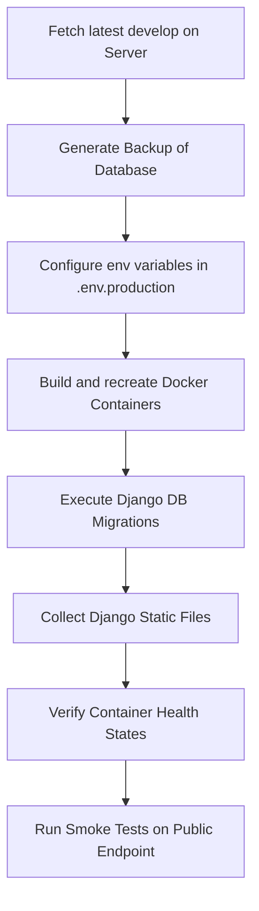

# Production Deployment Checklist - CORELASI

This document serves as the Tech Lead production deployment checklist for CORELASI. It compiles the deployment readiness criteria, environment configurations, backup strategies, execution workflows, rollback procedures, and smoke testing matrices required for a secure and reproducible deployment to the production environment.

---

## 1. Task Information

*   **Jira Key**: PM-74
*   **Sprint**: Sprint 12 - Deployment Preparation
*   **Owner**: Hafidz Musyafa Azmi (Tech Lead)
*   **Branch**: `feature/s12-deploy-checklist`
*   **Target Application URL**: `https://app.corelasi.my.id`
*   **Fallback Private URL (Tailscale)**: `https://desktop-0e2e0e5-1.tail320122.ts.net`

---

## 2. Deployment Readiness Checklist

Prior to launching execution steps on the production server, the following prerequisites must be verified.

| # | Check Item | Status | Verified By | Notes |
| :--- | :--- | :---: | :---: | :--- |
| 1 | Source branch `develop` is stable and passes all automated pipelines. | **Passed** | Tech Lead | Checked backend (113 tests pass) and frontend (104 tests pass, build OK). |
| 2 | Code audit completed: no hardcoded secrets, API keys, or private environment files exist in history. | **Passed** | Tech Lead | Security audit checklist was verified. `.env` files are excluded. |
| 3 | `.env.production` template prepared for deployment. | **Passed** | Tech Lead | Verified presence of `.env.production.example` and variables. |
| 4 | Database schema migrations are verified locally and ready for production. | **Passed** | Tech Lead | Migration files verified via `makemigrations --check`. |
| 5 | Frontend static assets compiled successfully for production environment. | **Passed** | Tech Lead | Checked `npm run build` succeeds under clean environment. |
| 6 | Docker Compose files and Dockerfiles verified for container deployment. | **Passed** | Tech Lead | `deploy/docker/` and `docker-compose.yml` baseline verified. |
| 7 | DNS records, Caddy reverse proxy, and Cloudflare Tunnel configurations are active. | **Passed** | Tech Lead | Verified Tailscale Serve and Caddy configurations. |
| 8 | Public URL endpoint routing verified. | **Passed** | Tech Lead | Smoke script verified for HTTP routing gates. |

> [!NOTE]
> **Status**: Ready for deployment preparation, final execution depends on Sprint 11 integration acceptance.

---

## 3. Environment Variables Checklist

The following environment variables must be defined on the production target machine inside the runtime environment (`.env.production` or systemd/docker configs). 

> [!WARNING]
> Do NOT commit actual values for these variables to git or log them in Jira.

### Backend Configurations
*   `DJANGO_SECRET_KEY`: Long, random cryptographic key for session/cookie signatures.
*   `DEBUG`: Must be set to `False` in production.
*   `ALLOWED_HOSTS`: List of domains/IPs authorized to access the site (e.g. `app.corelasi.my.id`, `localhost`).
*   `CSRF_TRUSTED_ORIGINS`: Origins authorized for secure POST requests (e.g. `https://app.corelasi.my.id`).
*   `CORS_ALLOWED_ORIGINS`: Origins allowed for cross-resource scripting (if frontend and backend domains are separate).
*   `DB_ENGINE`: Set to PostgreSQL engine in production (`django.db.backends.postgresql`).
*   `DB_NAME`: Database name for PostgreSQL.
*   `DB_USER`: Username for PostgreSQL connection.
*   `DB_PASSWORD`: Strong password for database user.
*   `DB_HOST`: Host address of the database container (`db`).
*   `DB_PORT`: Database port number (`5432`).
*   `SHOWCASE_MODE`: Set to `False` for real production (or `True` only if deploying for stakeholder showcases).
*   `SHOWCASE_ACCOUNT_EMAILS`: Comma-separated list of quick-login showcase emails.

### Frontend Configurations
*   `VITE_API_BASE_URL`: Base endpoint for API requests (e.g. `https://app.corelasi.my.id/api`).

---

## 4. Database and Backup Checkpoint

To prevent data loss and ensure system reliability, a database backup and restore validation checkpoint is established.

### A. Backup Procedure
1.  Verify the PostgreSQL container is active:
    ```bash
    docker compose ps
    ```
2.  Execute manual dump of database state before deployment:
    ```bash
    docker exec -t corelasi-prod-postgres pg_dumpall -c -U postgres > backup_pre_deploy.sql
    ```
3.  Archive the dump safely outside the active container directory.

### B. Restore & Migration Procedures
*   **Database Migrations**: Run migrations during container startup or manually inside the web container:
    ```bash
    docker compose exec backend python manage.py migrate --noinput
    ```
*   **Database Restore**: Refer to task **PM-75** for detailed step-by-step database restoration scripts and rollback recovery validations. Do not proceed to restore unless migration conflicts cannot be resolved via CLI.

---

## 5. Deployment Execution Workflow

Execution steps to be performed sequentially by the deployment operator.



1.  **Pull changes**: Fetch and checkout the release tag or develop branch on the deployment server.
2.  **Generate Backup**: Run the database backup procedure described in Section 4.
3.  **Validate Environment**: Check `.env.production` variables list against Section 3.
4.  **Recreate Services**: Build and start containers using docker compose:
    ```bash
    docker compose -f docker-compose.prod.yml down
    docker compose -f docker-compose.prod.yml up -d --build
    ```
5.  **Run Migrations**: Apply database changes:
    ```bash
    docker compose -f docker-compose.prod.yml exec backend python manage.py migrate --noinput
    ```
6.  **Collect Static Assets**: Collect files for Caddy reverse proxy mapping:
    ```bash
    docker compose -f docker-compose.prod.yml exec backend python manage.py collectstatic --noinput
    ```
7.  **Verify Services**: Ensure container status is healthy:
    ```bash
    docker compose -f docker-compose.prod.yml ps
    ```

---

## 6. Rollback Procedures

In the event of a critical failure during smoke testing or service start-up, execute these rollback tasks.

1.  **Identify Previous Stable Release**: Check the releases log or active directory:
    ```bash
    ls -l /home/hafidz/apps/corelasi/releases/
    ```
2.  **Restore Docker Containers to Previous Release**:
    *   Change current symlink back to the previous stable release folder.
    *   Recreate containers using the previous docker compose configurations.
3.  **Restore Database State**:
    *   If database migrations are backwards-incompatible and the system fails to startup, restore the pre-deploy database dump:
        ```bash
        cat backup_pre_deploy.sql | docker exec -i corelasi-prod-postgres psql -U postgres
        ```
4.  **Verify Rollback**: Rerun the smoke testing suite on the public URL to verify recovery.

---

## 7. Smoke Test Verification Matrix

Following a successful deploy, the operator must execute the following test scenarios to verify production integration.

| Area | Scenario | Expected Behavior | Status | Evidence / Notes |
| :--- | :--- | :--- | :---: | :--- |
| **Public URL** | Access `https://app.corelasi.my.id` in a clean browser session. | Returns HTTP 200 and loads the login page correctly. | Pending | Execute on deploy |
| **Login Admin** | Authenticate using admin credentials. | Successful redirect to `/admin/dashboard` layout. | Pending | Check cookies / tokens |
| **Login Guru** | Authenticate using teacher credentials. | Successful redirect to `/guru/dashboard` layout. | Pending | Verify role chips |
| **Login Siswa** | Authenticate using student credentials. | Successful redirect to `/siswa/dashboard` layout. | Pending | Verify dashboard modules |
| **Dashboard** | Check card summaries across all three roles. | Numerical KPI displays use exactly 28px font sizes. | Pending | Visual typography check |
| **Schedule** | Open schedule board for Guru/Siswa roles. | Correctly displays weekly class times and teachers. | Pending | Verify grid alignment |
| **Attendance** | Guru Pengampu records student attendance. | Input status locked to Hadir/Alpa only (Sakit/Izin locked). | Pending | Domain rule validation |
| **Learning** | Siswa downloads materials and submits work. | External link submission completes as "Terkumpul". | Pending | Verify file links |
| **Reports** | Admin opens operational reports. | Operational table loads cleanly without infinite spinner. | Pending | Test export button |
| **Logout** | Click logout action on any active session. | Clears local session, redirects back to `/login`. | Pending | Verify cookie removal |

---

## 8. S12 Task Dependencies

PM-74 is the foundational Tech Lead checklist. Execution of Sprint 12 depends on parallel tasks owned by respective team members:

1.  **PM-75 (Backup & Restore Detail)**: Owner Backend (Haafizd / Gilang). Detail scripts for automated daily database backup and data restore plans.
2.  **PM-76 (Production Build Verification)**: Owner Frontend (Fadhli). Verification of frontend build compression, chunking optimization, and bundle size limits.
3.  **PM-77 (QA Release Candidate)**: Owner QA (Khansa). Manual and E2E automation smoke verification on WSL2 staging prior to production push.
4.  **PM-78 (Final UI/Figma Verification)**: Owner UI/UX (Khansa / Fadhli). Crosscheck final pixel-perfect styling against Figma frames.

---

## 9. Release Readiness Decision

*   **Status**: **Ready for deployment preparation, final execution depends on Sprint 11 integration acceptance.**
*   **Notes**: The Sprint 11 integration commits have been merged into `develop`, but a fresh build requires updating dependencies. This checklist is ready for deployment preparation pending final acceptance of Sprint 11 integration.

