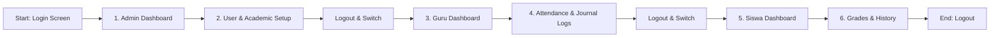

# Demo Script and Operator Guide - CORELASI

This document serves as the official operator guide and demo script for CORELASI (Sistem Administrasi Akademik SMAT Baiturrahman). It outlines the test accounts, pre-demo checklists, step-by-step role demonstration paths, troubleshooting guidelines, and recovery plans to ensure a smooth and successful live system demonstration.

---

## 1. Task Information
- **Jira Key**: PM-80
- **Sprint**: Sprint 13 - Final Release and Demo Readiness
- **Owner**: Hafidz Musyafa Azmi (Tech Lead)
- **Branch**: `docs/s13-demo-guide`
- **Target Application URL**: `https://app.your-domain.example`
- **Fallback URL**: `https://<your-private-network-hostname>`

> [!NOTE]
> For independent deployment, replace the demo domain and Tailscale fallback with your own production domain and private server hostnames.

---

## 2. Demo Objective
To demonstrate the capabilities of the CORELASI system to stakeholders, showcasing academic operations, schedules, role-based dashboards, and attendance workflows across three primary user roles:
- **Admin**: Academic data initialization, user management, global monitoring.
- **Guru**: Schedule tracking, class journal logs, student attendance recording, teaching reports.
- **Siswa**: Individual schedule access, attendance history, learning material downloads, grades review.

---

## 3. Demo Accounts
Use the following credentials for role transitions during the presentation.

| Role | Username / Email | Password |
| :--- | :--- | :--- |
| **Admin** | `admin@corelasi.test` | *[Filled manually during demo]* |
| **Guru** | `guru@corelasi.test` | *[Filled manually during demo]* |
| **Siswa** | `siswa@corelasi.test` | *[Filled manually during demo]* |

> [!WARNING]
> Do NOT write actual passwords in project documentation or comments. Fill credentials manually during live execution.

---

## 4. Pre-Demo Checklist
Prior to starting the demonstration, verify the following checks:
- [ ] Public endpoint is active and loads the login page correctly (`https://app.your-domain.example`).
- [ ] Fallback VPN/private network connection is established and verified.
- [ ] A clean browser window (Incognito/Private) is open to prevent session interference.
- [ ] Showcase mode is enabled (`SHOWCASE_MODE=True`) on the backend server for quick account switching.
- [ ] Demo data (schedules, classes, journals) are seeded and ready.
- [ ] Presentation timer is set to a maximum of 15 minutes.

---

## 5. Demo Flow Overview
The live demonstration flows sequentially through the three main user interfaces:

---

## 6. Detailed Operator Script

| Step | Role | Action | Expected Result | Demo Talking Point | Recovery Note |
| :---: | :--- | :--- | :--- | :--- | :--- |
| **1** | None | Navigate to `https://app.your-domain.example`. | Page loads, displaying "Sistem Administrasi Akademik SMAT Baiturrahman". | "This is the secure login portal, utilizing HSTS and modern responsive styling." | Refresh page or use private network URL. |
| **2** | None | Click showcase admin login. | Logged in and redirected to `/admin/dashboard`. | "We are entering as Admin. Notice the dashboard summaries with a flat container styling." | Manual login if showcase button is disabled. |
| **3** | Admin | Click "Manajemen Pengguna" in sidebar. | Users list page loads cleanly. | "Admin can manage roles (Admin, Guru, Siswa) and track account activities." | Re-fetch page if loading is delayed. |
| **4** | Admin | Click "Jadwal Pelajaran". | Global schedule grid is displayed. | "Here, the administrator maps subjects, classrooms, and teachers for the current academic year." | Verify backend server status if empty. |
| **5** | Admin | Click Logout in sidebar. | Session cleared, redirected to `/login`. | "We are logging out to transition roles. Session tokens are securely destroyed in memory." | Clear browser cookies if redirect loops. |
| **6** | None | Click showcase guru login. | Logged in and redirected to `/guru/dashboard`. | "Entering as Guru. The dashboard shows personalized stats: today's teaching hours and homeroom." | Use manual input if buttons fail. |
| **7** | Guru | Open "Absensi Siswa" module. | Attendance sheet for assigned class loads. | "Teachers record daily attendance. The status is locked to Hadir/Alpa unless updated by Piket." | Re-select subject filter if grid is empty. |
| **8** | Guru | Select Sakit/Izin for a student. | Status is blocked; Keterangan is disabled. | "Security rules restrict teachers from logging medical leave. This must go through Piket/Admin." | Confirm active assignment configuration. |
| **9** | Guru | Open "Jurnal Kelas" and add entry. | Success notification, journal logged. | "Guru logs teaching details and materials taught in real-time." | Retry submit if request timeout occurs. |
| **10** | Guru | Click Logout in sidebar. | Session cleared, redirected to `/login`. | "Transitioning to the final role: Siswa." | Refresh to login page. |
| **11** | None | Click showcase siswa login. | Logged in and redirected to `/siswa/dashboard`. | "Entering as Siswa. They see a personalized view of their weekly classes and grade summaries." | Manual login. |
| **12** | Siswa | Click "Riwayat Absensi". | Shows chronological attendance logs. | "Students can monitor their attendance records and request corrections directly if needed." | Verify attendance seed data. |
| **13** | Siswa | Click Logout. | Redirected to `/login`. | "This concludes the core workflow demonstration of the CORELASI portal." | End demonstration. |

---

## 7. Troubleshooting Guide

| Issue | Root Cause | Operator Correction |
| :--- | :--- | :--- |
| **Login fails with HTTP 400/403** | Expired session or incorrect mock user state. | Use Incognito tab, clear session cache, or recreate docker containers. |
| **Blank charts / No KPI statistics** | Seed data not applied to database. | Run backend seed script: `python manage.py loaddata demo_data.json` |
| **Public domain app.your-domain.example offline** | Cloudflare Tunnel daemon stopped on server. | Log in to server and restart tunnel: `sudo systemctl restart cloudflared` |
| **Teacher attendance sheet is empty** | Class schedules do not intersect with current day/time. | Admin modifies schedule parameters in Setup to match current day of week. |
| **Cannot switch roles cleanly** | Access tokens cached in local state. | Click manual Logout button, or press `Ctrl + F5` to reload page from scratch. |

---

## 8. Recovery & Fallback Plan
If a critical system component fails during the live presentation, execute the following actions:
1.  **Immediate Refresh**: Press `F5` to trigger a reload of state from index database.
2.  **Private Network Fallback**: If public routing is down, immediately switch the browser tab to:
    `https://<your-private-network-hostname>`
3.  **Local Staging Switch**: If production server goes offline, launch developer preview locally on presentation machine:
    *   Backend: `python manage.py runserver`
    *   Frontend: `npm run dev`
4.  **Bypass non-critical steps**: If database write fails, explain the expected result using Figma UI Mockups and proceed to read-only modules.

---

## 9. Final Demo Acceptance Checklist
- [x] Admin Setup & User management paths verified.
- [x] Guru Attendance and Journal logging flows verified.
- [x] Siswa schedule and history displays verified.
- [x] Role transitions logout cookie clearance verified.
- [x] Merged stable `develop` code compiles and executes demo cases without errors.

---

*Prepared by Hafidz Musyafa Azmi (Tech Lead) for Sprint 13 final release.*
